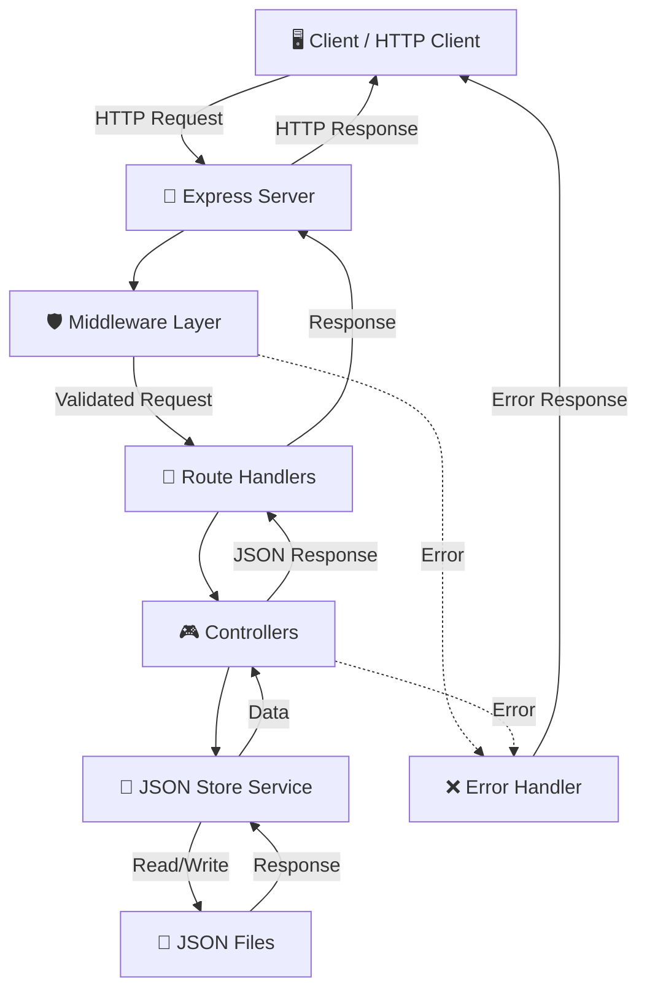
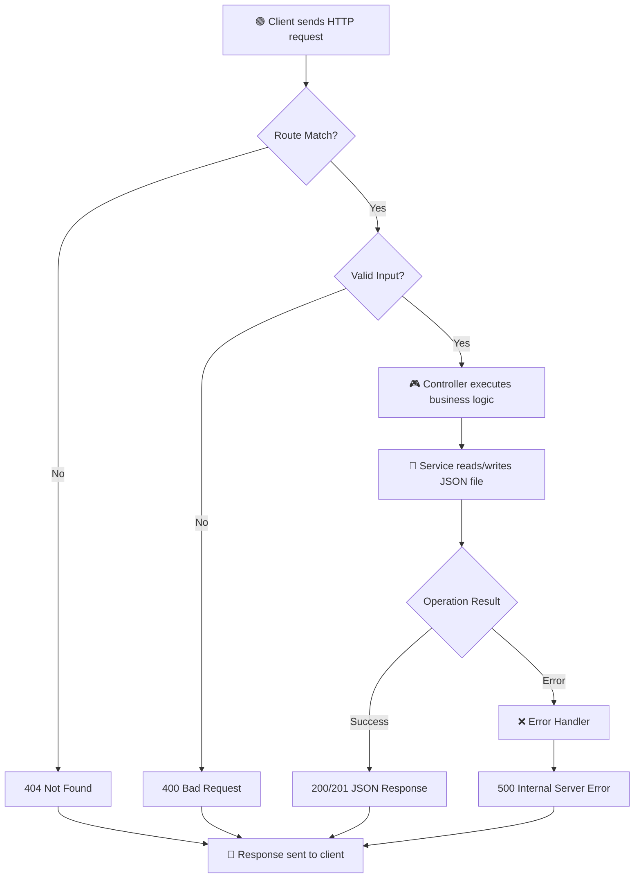
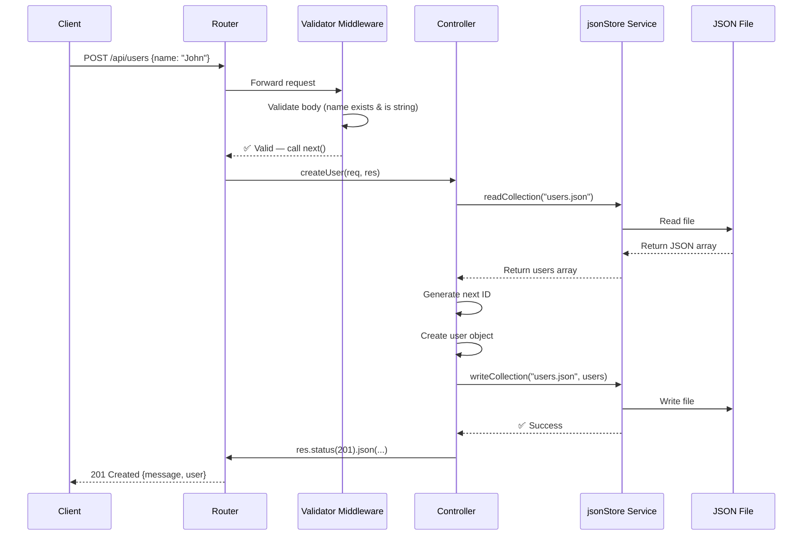
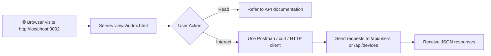

# My Express App

[](https://nodejs.org/)
[](https://expressjs.com/)
[](LICENSE)
[](https://github.com/)

> A lightweight, file-based RESTful API built with Express.js for managing users and devices.

---

## 📌 Project Overview

**My Express App** is a modular REST API server that provides full CRUD operations for **Users** and **Devices** using a JSON file-based storage system. Built on **Express 5**, it demonstrates clean architecture with separated concerns — routes, controllers, middleware, services, and data layers — making it an excellent reference project for learning backend development patterns.

### Key Goals
- 🎯 Provide a simple, dependency-free API with persistent JSON storage
- 🏗️ Demonstrate clean separation of concerns in Express applications
- 🔒 Implement input validation and centralized error handling
- 📖 Serve as a learning resource for REST API design

---

## 🚀 What's New (v1.0.0)

| Type | Description |
|------|-------------|
| ✨ **Feature** | Full CRUD API for **Users** (`/api/users`) and **Devices** (`/api/devices`) |
| ✨ **Feature** | JSON file-based data persistence with auto-incrementing IDs |
| 🛡️ **Middleware** | Request validation for ID params and request bodies |
| 🛡️ **Middleware** | Centralized 404 handler and global error handler |
| ⚙️ **Config** | Environment variable support via `dotenv` |
| 🌐 **Frontend** | Basic HTML landing page served at root (`/`) |
| 🔧 **DevEx** | Nodemon hot-reload for development workflow |

---

## 🏗️ Project Architecture

The application follows a **layered architecture** pattern:



### Architectural Layers

| Layer | Responsibility | Files |
|-------|----------------|-------|
| **Server** | Express app bootstrap, middleware registration, server startup | `app.js` |
| **Routes** | URL-to-handler mapping, route-level validation chaining | `routes/*.js` |
| **Controllers** | Business logic, request/response handling | `controller/*.js` |
| **Services** | Data access abstraction (file I/O) | `services/jsonStore.js` |
| **Middleware** | Validation, error handling, 404 catch-all | `middleware/*.js` |
| **Data** | Persistent JSON file storage | `data/*.json` |

---

## 📂 Folder Structure

```
express-app/
├── app.js                 # 🚀 Express app entry point
├── package.json           # 📦 Dependencies & scripts
├── .env                   # 🔐 Environment configuration
├── .gitignore             # 🚫 Git exclusions
│
├── controller/            # 🎮 Business logic layer
│   ├── userController.js  #    User CRUD operations
│   └── deviceController.js#    Device CRUD operations
│
├── routes/                # 📡 Route definitions
│   ├── route.js           #    Root route (serves HTML)
│   ├── userRoutes.js      #    /api/users endpoints
│   └── devices.js         #    /api/devices endpoints
│
├── middleware/            # 🛡️ Request processing middleware
│   ├── errorMiddleware.js #    404 + global error handler
│   └── validateRequest.js #    ID & body validation helpers
│
├── services/            # 💾 Data access layer
│   └── jsonStore.js     #    File-based JSON read/write utilities
│
├── data/                # 📄 Persistent storage
│   ├── users.json       #    User records
│   └── devices.json     #    Device records
│
└── views/               # 🌐 Static HTML
    └── index.html       #    Landing page
```

---

## 🔄 Application Flow



### Step-by-Step Flow

1. **Request Arrival** — Client sends an HTTP request to the server
2. **Route Matching** — Express router matches the request path to a registered route
3. **Validation** — Middleware validates URL params (`id`) and request body (`name`)
4. **Controller Execution** — The matched controller invokes business logic
5. **Data Access** — `jsonStore` service reads/writes the appropriate JSON file
6. **Response** — Results are serialized to JSON and returned to the client
7. **Error Handling** — Any unhandled errors are caught by the global error middleware

---

## 📊 Data Flow / Process Visualization



### API Endpoints Reference

| Method | Endpoint | Description | Request Body | Success Code |
|--------|----------|-------------|--------------|--------------|
| `GET` | `/` | Serve landing page | — | 200 |
| `GET` | `/api/users` | List all users | — | 200 |
| `GET` | `/api/users/:id` | Get user by ID | — | 200 |
| `POST` | `/api/users` | Create a new user | `{ "name": "string" }` | 201 |
| `PUT` | `/api/users/:id` | Update user by ID | `{ "name": "string" }` | 200 |
| `DELETE` | `/api/users/:id` | Delete user by ID | — | 200 |
| `GET` | `/api/devices` | List all devices | — | 200 |
| `GET` | `/api/devices/:id` | Get device by ID | — | 200 |
| `POST` | `/api/devices` | Create a new device | `{ "name": "string" }` | 201 |
| `PUT` | `/api/devices/:id` | Update device by ID | `{ "name": "string" }` | 200 |
| `DELETE` | `/api/devices/:id` | Delete device by ID | — | 200 |

---

## 🖥️ UI/UX Flow

The application is primarily **API-first** with a minimal frontend:



### Best Practices Applied
- ✅ **RESTful conventions** — Standard HTTP methods map to CRUD operations
- ✅ **Consistent response format** — All responses follow `{ message, data }` structure
- ✅ **Proper HTTP status codes** — 200 (OK), 201 (Created), 400 (Bad Request), 404 (Not Found), 500 (Server Error)
- ✅ **Input sanitization** — Request body `name` is trimmed before persistence

---

## ⚙️ Installation & Setup

### Prerequisites

- **Node.js** 18+ installed
- **npm** (comes with Node.js)

### Quick Start

```bash
# 1. Clone or navigate to the project
cd express-app

# 2. Install dependencies
npm install

# 3. Configure environment (optional — defaults provided)
# Edit .env to change PORT if needed

# 4. Start the server
npm start        # Production mode
npm run dev      # Development mode with hot-reload (nodemon)
```

### Verify Installation

```bash
curl http://localhost:3002
# Should return the index.html content

curl http://localhost:3002/api/users
# Should return the users JSON array
```

---

## 🧪 Usage

### Environment Variables

| Variable | Description | Default |
|----------|-------------|---------|
| `PORT` | Server listening port | `3002` |

### Example API Calls

**Create a User:**
```bash
curl -X POST http://localhost:3002/api/users \
  -H "Content-Type: application/json" \
  -d '{"name": "John Doe"}'
```

**Get All Devices:**
```bash
curl http://localhost:3002/api/devices
```

**Update a User:**
```bash
curl -X PUT http://localhost:3002/api/users/1 \
  -H "Content-Type: application/json" \
  -d '{"name": "Jane Doe"}'
```

**Delete a Device:**
```bash
curl -X DELETE http://localhost:3002/api/devices/3
```

### Error Responses

```json
// Invalid ID format
{ "message": "id must be a positive integer" }

// Missing name in body
{ "message": "name is required" }

// Resource not found
{ "message": "User not found" }

// Route not found
{ "message": "Route not found: GET /api/unknown" }

// Server error
{ "message": "Internal server error" }
```

---

## 📈 Future Improvements

| Area | Planned Enhancement |
|------|---------------------|
| 🔐 **Authentication** | JWT-based auth for protected endpoints |
| 🗄️ **Database** | Migrate from JSON files to PostgreSQL / MongoDB |
| 📝 **Validation** | Expand to full schema validation (Zod / Joi) |
| 📄 **Pagination** | Add pagination & filtering for list endpoints |
| 🧪 **Testing** | Unit & integration tests with Jest / Supertest |
| 📚 **Documentation** | Auto-generated OpenAPI / Swagger docs |
| 🐳 **Docker** | Containerized deployment with Docker Compose |
| 📊 **Logging** | Structured logging with Winston / Pino |
| 🔒 **Security** | Helmet, CORS, rate limiting middleware |

---

## 🤝 Contribution Guide

Contributions are welcome! Follow these steps:

1. **Fork** the repository
2. **Create** a feature branch: `git checkout -b feature/amazing-feature`
3. **Commit** your changes: `git commit -m 'Add amazing feature'`
4. **Push** to the branch: `git push origin feature/amazing-feature`
5. **Open** a Pull Request

### Guidelines
- Follow existing code style and ES module syntax
- Add validation middleware for new endpoints
- Test your changes with `curl` or Postman before submitting
- Keep commits atomic and descriptive

---

## 📄 License

This project is licensed under the **ISC License**.

---

<p align="center">Built with ❤️ using Express.js</p>
